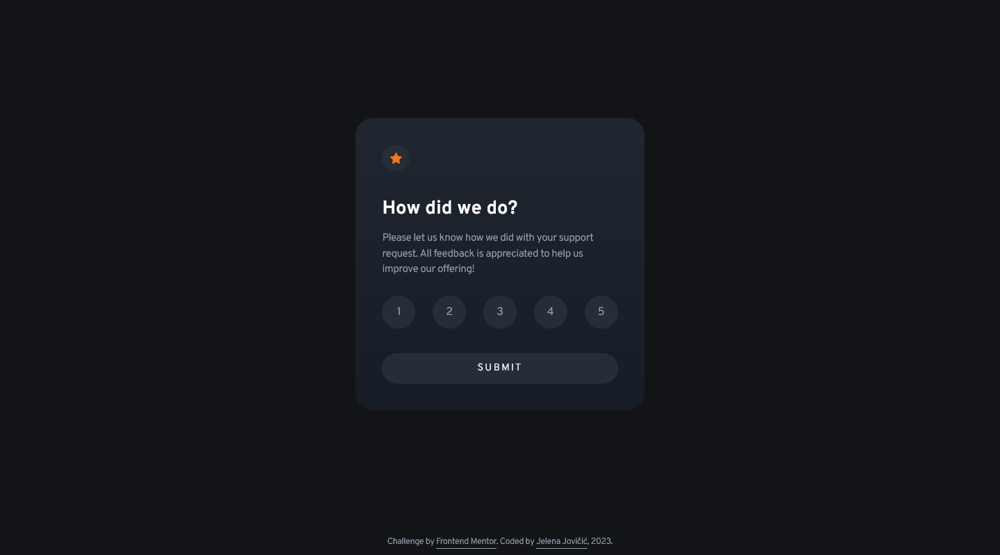

# Frontend Mentor - Interactive rating component solution

This is a solution to the [Interactive rating component challenge on Frontend Mentor](https://www.frontendmentor.io/challenges/interactive-rating-component-koxpeBUmI). Frontend Mentor challenges help you improve your coding skills by building realistic projects. 

## Table of contents

- [Overview](#overview)
  - [Description](#description)
  - [Screenshot](#screenshot)
  - [Links](#links)
- [My process](#my-process)
  - [Built with](#built-with)
  - [Observations](#observations)
  - [Useful resources](#useful-resources)
- [Author](#author)
- [Acknowledgments](#acknowledgments)

## Overview

### Description

A small interactive component that handles user interactions and updates the DOM. Users should be able to: 

- [x] View the optimal layout for the app depending on their device's screen size
- [x] See hover states for all interactive elements on the page
- [x] Select and submit a number rating
- [x] See the "Thank you" card state after submitting a rating

### Screenshot

  

### Links

- [Solution](...)
- [Live](https://je-jo.github.io/interactive-rating-component/)

## My process

### Built with

- Semantic HTML5 markup
- Mobile-first workflow
- JavaScript
- Sass (7-in-1 pattern)

### Observations

The project uses hidden radio buttons for ratings, and a dialog element to show the "Thank you" card.

### Useful resources

- [google web fonts helper](http://google-webfonts-helper.herokuapp.com/fonts) - A Hassle-Free Way to Self-Host Google Fonts.
- [7-1 pattern boilerplate](https://github.com/KittyGiraudel/sass-boilerplate/tree/master/stylesheets) - A boilerplate for 7-1 Sass Architecture.
- [HTML / Sass Jumpstart]() - Mostly plucked some sensible values (font sizes, spacings, buttons, etc) from here and a reset file.
- [PerfectPixel](https://www.welldonecode.com/perfectpixel/) a Chrome extension for comparing website with design image.
- [Introducing the Dialog Element](https://webkit.org/blog/12209/introducing-the-dialog-element/)

## Author

- [Github](https://github.com/je-jo)
- [LinkedIn](https://www.linkedin.com/in/jelena-jovicic/)
- [Frontend Mentor](https://www.frontendmentor.io/profile/je-jo)
- [Codepen](https://codepen.io/je-jo)
- [Twitter](https://twitter.com/jelena_jo_)